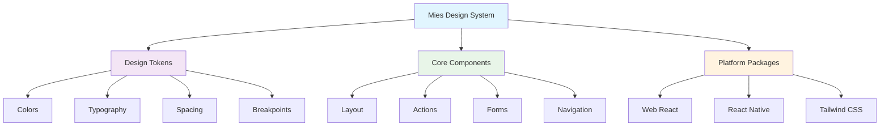
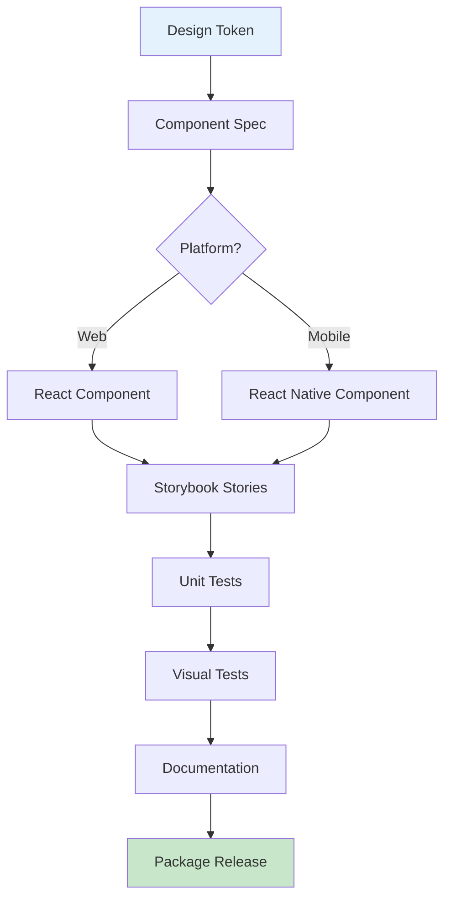
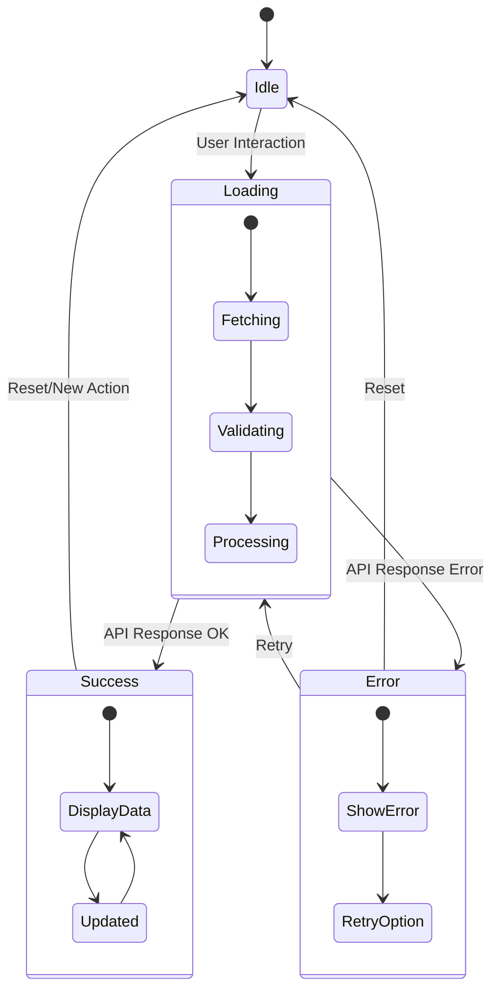

# Examples

Practical examples showing how to use Tanqory Mies in real applications.

## Interactive Component Playground

Try editing the components below to see changes in real-time:

```jsx live
function MiesButton() {
  const [count, setCount] = React.useState(0);
  const [variant, setVariant] = React.useState('primary');
  
  const buttonStyles = {
    primary: {
      backgroundColor: '#2e8555',
      color: 'white',
      border: 'none'
    },
    secondary: {
      backgroundColor: '#f8f9fa',
      color: '#2e8555',
      border: '2px solid #2e8555'
    }
  };
  
  const baseStyle = {
    padding: '12px 24px',
    borderRadius: '8px',
    fontSize: '16px',
    fontWeight: '600',
    cursor: 'pointer',
    transition: 'all 0.2s ease',
    marginRight: '8px',
    marginBottom: '8px'
  };
  
  return (
    <div style={{ padding: '20px', fontFamily: 'Inter, sans-serif' }}>
      <h3 style={{ marginBottom: '16px' }}>Interactive Mies Button</h3>
      
      <div style={{ marginBottom: '16px' }}>
        <button 
          style={{...baseStyle, ...buttonStyles[variant]}}
          onClick={() => setCount(count + 1)}
        >
          Clicked {count} times
        </button>
        
        <button
          style={{...baseStyle, backgroundColor: '#dc3545', color: 'white', border: 'none'}}
          onClick={() => setCount(0)}
        >
          Reset
        </button>
      </div>
      
      <div>
        <label style={{ marginRight: '16px' }}>
          <input
            type="radio"
            name="variant"
            checked={variant === 'primary'}
            onChange={() => setVariant('primary')}
            style={{ marginRight: '8px' }}
          />
          Primary Style
        </label>
        
        <label>
          <input
            type="radio"
            name="variant"
            checked={variant === 'secondary'}
            onChange={() => setVariant('secondary')}
            style={{ marginRight: '8px' }}
          />
          Secondary Style
        </label>
      </div>
    </div>
  );
}
```

## Design System Architecture



## Component Development Flow



## Interactive Form Example

```jsx live
function ContactForm() {
  const [formData, setFormData] = React.useState({
    name: '',
    email: '',
    message: ''
  });
  
  const [errors, setErrors] = React.useState({});
  const [isSubmitted, setIsSubmitted] = React.useState(false);
  
  const handleChange = (e) => {
    const { name, value } = e.target;
    setFormData(prev => ({
      ...prev,
      [name]: value
    }));
    
    // Clear error when user starts typing
    if (errors[name]) {
      setErrors(prev => ({
        ...prev,
        [name]: ''
      }));
    }
  };
  
  const validate = () => {
    const newErrors = {};
    
    if (!formData.name.trim()) {
      newErrors.name = 'Name is required';
    }
    
    if (!formData.email.trim()) {
      newErrors.email = 'Email is required';
    } else if (!/\S+@\S+\.\S+/.test(formData.email)) {
      newErrors.email = 'Please enter a valid email';
    }
    
    if (!formData.message.trim()) {
      newErrors.message = 'Message is required';
    }
    
    return newErrors;
  };
  
  const handleSubmit = (e) => {
    e.preventDefault();
    const validationErrors = validate();
    
    if (Object.keys(validationErrors).length > 0) {
      setErrors(validationErrors);
      return;
    }
    
    setIsSubmitted(true);
    // Reset form after 3 seconds
    setTimeout(() => {
      setIsSubmitted(false);
      setFormData({ name: '', email: '', message: '' });
    }, 3000);
  };
  
  const inputStyle = {
    width: '100%',
    padding: '12px 16px',
    border: '2px solid #e0e0e0',
    borderRadius: '8px',
    fontSize: '16px',
    fontFamily: 'inherit',
    transition: 'border-color 0.2s ease',
    outline: 'none'
  };
  
  const errorStyle = {
    color: '#dc3545',
    fontSize: '14px',
    marginTop: '4px',
    marginBottom: '16px'
  };
  
  const buttonStyle = {
    width: '100%',
    padding: '14px 24px',
    backgroundColor: '#2e8555',
    color: 'white',
    border: 'none',
    borderRadius: '8px',
    fontSize: '16px',
    fontWeight: '600',
    cursor: 'pointer',
    transition: 'background-color 0.2s ease'
  };
  
  if (isSubmitted) {
    return (
      <div style={{ 
        maxWidth: '400px', 
        padding: '40px 20px', 
        textAlign: 'center',
        backgroundColor: '#d4edda',
        borderRadius: '12px',
        border: '1px solid #c3e6cb'
      }}>
        <h3 style={{ color: '#155724', marginBottom: '16px' }}>
          ✅ Message Sent Successfully!
        </h3>
        <p style={{ color: '#155724', margin: 0 }}>
          Thank you for contacting us. We'll get back to you soon.
        </p>
      </div>
    );
  }
  
  return (
    <div style={{ 
      maxWidth: '400px', 
      padding: '24px',
      backgroundColor: '#f8f9fa',
      borderRadius: '12px',
      border: '1px solid #e0e0e0'
    }}>
      <h3 style={{ marginBottom: '24px', color: '#333' }}>Contact Form</h3>
      
      <form onSubmit={handleSubmit}>
        <div style={{ marginBottom: '16px' }}>
          <input
            style={{
              ...inputStyle,
              borderColor: errors.name ? '#dc3545' : 
                formData.name ? '#2e8555' : '#e0e0e0'
            }}
            type="text"
            name="name"
            placeholder="Your Name"
            value={formData.name}
            onChange={handleChange}
          />
          {errors.name && <div style={errorStyle}>{errors.name}</div>}
        </div>
        
        <div style={{ marginBottom: '16px' }}>
          <input
            style={{
              ...inputStyle,
              borderColor: errors.email ? '#dc3545' : 
                formData.email ? '#2e8555' : '#e0e0e0'
            }}
            type="email"
            name="email"
            placeholder="your.email@example.com"
            value={formData.email}
            onChange={handleChange}
          />
          {errors.email && <div style={errorStyle}>{errors.email}</div>}
        </div>
        
        <div style={{ marginBottom: '24px' }}>
          <textarea
            style={{
              ...inputStyle,
              height: '100px',
              resize: 'vertical',
              borderColor: errors.message ? '#dc3545' : 
                formData.message ? '#2e8555' : '#e0e0e0'
            }}
            name="message"
            placeholder="Your message here..."
            value={formData.message}
            onChange={handleChange}
          />
          {errors.message && <div style={errorStyle}>{errors.message}</div>}
        </div>
        
        <button
          type="submit"
          style={{
            ...buttonStyle,
            backgroundColor: Object.values(formData).every(v => v.trim()) ? '#2e8555' : '#6c757d'
          }}
        >
          Send Message
        </button>
      </form>
    </div>
  );
}
```

## Component State Flow



## Live Examples

### Web Application
A complete e-commerce demo built with Next.js 15 and Tanqory Mies components.

**Features:**
- Product catalog
- Shopping cart
- User authentication
- Responsive design
- Server-side rendering

[View Demo →](http://localhost:3001) | [Source Code →](https://github.com/tanqory/mies/tree/main/examples/web-app)

### Mobile Application
React Native app demonstrating cross-platform component usage.

**Features:**
- Product listings
- Native navigation
- Platform-specific optimizations
- Shared design tokens

[Source Code →](https://github.com/tanqory/mies/tree/main/examples/mobile-app)

## Quick Start Templates

### Web Project Setup

```bash
# Create new Next.js project
npx create-next-app@latest my-app --typescript --app

# Install Tanqory Mies
cd my-app
npm install @tanqory/mies-core-web @tanqory/mies-tailwind

# Configure Tailwind
echo "module.exports = require('@tanqory/mies-tailwind')" > tailwind.config.js
```

### Basic Component Usage

```tsx
import { Button, Card } from '@tanqory/mies-core-web';
import { CartIcon } from '@tanqory/mies-icons/web';

export default function ProductCard({ product }) {
  return (
    <Card padding="base" bordered>
      <h3>{product.name}</h3>
      <p>{product.price}</p>
      <Button variant="primary">
        <CartIcon size={16} />
        Add to Cart
      </Button>
    </Card>
  );
}
```

### Mobile Project Setup

```bash
# Create new Expo project
npx create-expo-app MyApp --template blank-typescript

# Install Tanqory Mies
cd MyApp
npm install @tanqory/mies-core-native @tanqory/mies-tokens
npm install react-native-svg # Required for icons
```

### Mobile Component Usage

```tsx
import { Button, Card } from '@tanqory/mies-core-native';
import { CartIcon } from '@tanqory/mies-icons/native';
import tokens from '@tanqory/mies-tokens/tokens.json';

export default function ProductCard({ product }) {
  return (
    <Card padding="base" bordered>
      <Text style={{ fontSize: tokens.typography.fontSize.lg }}>
        {product.name}
      </Text>
      <Text style={{ color: tokens.colors.black }}>
        {product.price}
      </Text>
      <Button variant="primary">
        <CartIcon size={16} color={tokens.colors.white} />
        Add to Cart
      </Button>
    </Card>
  );
}
```

## Integration Examples

### With Next.js App Router

```tsx
// app/layout.tsx
import '@tanqory/mies-tokens/tokens.css';
import '@tanqory/mies-tailwind/dist/index.css';

export default function RootLayout({
  children,
}: {
  children: React.ReactNode;
}) {
  return (
    <html lang="en">
      <body className="font-sans bg-white text-black">
        {children}
      </body>
    </html>
  );
}
```

### With React Native Navigation

```tsx
// App.tsx
import { NavigationContainer } from '@react-navigation/native';
import { createNativeStackNavigator } from '@react-navigation/native-stack';
import { Header } from '@tanqory/mies-core-native/layout';

const Stack = createNativeStackNavigator();

export default function App() {
  return (
    <NavigationContainer>
      <Stack.Navigator>
        <Stack.Screen 
          name="Home" 
          component={HomeScreen}
          options={{
            header: () => <Header title="My Store" />
          }}
        />
      </Stack.Navigator>
    </NavigationContainer>
  );
}
```

## Common Patterns

### E-commerce Product Grid

```tsx
import { Container, Grid } from '@tanqory/mies-core-web/layout';
import { Card } from '@tanqory/mies-core-web/card';
import { Button } from '@tanqory/mies-core-web/button';

export default function ProductGrid({ products }) {
  return (
    <Container>
      <Grid columns={3} gap="base">
        {products.map(product => (
          <Card key={product.id} padding="base" bordered>
            
            <h3 className="text-lg font-medium mt-12">{product.name}</h3>
            <p className="text-base text-black opacity-70">{product.price}</p>
            <Button variant="primary" className="mt-16 w-full">
              Add to Cart
            </Button>
          </Card>
        ))}
      </Grid>
    </Container>
  );
}
```

### Shopping Cart Summary

```tsx
import { Card, CardHeader, CardContent } from '@tanqory/mies-core-web/card';
import { Button } from '@tanqory/mies-core-web/button';
import { Stack } from '@tanqory/mies-core-web/layout';

export default function CartSummary({ items, total }) {
  return (
    <Card padding="lg" bordered>
      <CardHeader>
        <h2 className="text-xl font-medium">Order Summary</h2>
      </CardHeader>
      <CardContent>
        <Stack spacing="base">
          {items.map(item => (
            <div key={item.id} className="flex justify-between">
              <span>{item.name}</span>
              <span>{item.price}</span>
            </div>
          ))}
          <hr className="border-black" />
          <div className="flex justify-between font-medium">
            <span>Total</span>
            <span>{total}</span>
          </div>
          <Button variant="primary" className="w-full">
            Checkout
          </Button>
        </Stack>
      </CardContent>
    </Card>
  );
}
```

## TypeScript Configuration

### Strict Type Safety

```json
// tsconfig.json
{
  "compilerOptions": {
    "strict": true,
    "noImplicitAny": true,
    "noImplicitReturns": true,
    "noImplicitThis": true,
    "noUncheckedIndexedAccess": true
  }
}
```

### Component Props Types

```tsx
import type { ComponentProps } from 'react';
import type { ButtonProps } from '@tanqory/mies-core-web/button';

interface ProductCardProps {
  product: {
    id: string;
    name: string;
    price: string;
    image: string;
  };
  onAddToCart?: (productId: string) => void;
  buttonProps?: Partial<ButtonProps>;
}

export function ProductCard({ 
  product, 
  onAddToCart,
  buttonProps 
}: ProductCardProps) {
  // Component implementation
}
```

## Performance Optimization

### Tree Shaking

```tsx
// ✅ Import only what you need
import { Button } from '@tanqory/mies-core-web/button';
import { CartIcon } from '@tanqory/mies-icons/web';

// ❌ Avoid importing everything
import * as Mies from '@tanqory/mies-core-web';
```

### Bundle Analysis

```bash
# Analyze bundle size
npm install --save-dev @next/bundle-analyzer

# Add to next.config.js
const withBundleAnalyzer = require('@next/bundle-analyzer')({
  enabled: process.env.ANALYZE === 'true',
});

module.exports = withBundleAnalyzer({
  // Next.js config
});

# Run analysis
ANALYZE=true npm run build
```

## Testing

### Component Testing

```tsx
import { render, screen } from '@testing-library/react';
import { Button } from '@tanqory/mies-core-web/button';

test('renders button with text', () => {
  render(<Button>Click me</Button>);
  expect(screen.getByRole('button')).toHaveTextContent('Click me');
});

test('applies variant styles', () => {
  render(<Button variant="primary">Primary</Button>);
  expect(screen.getByRole('button')).toHaveClass('bg-brand');
});
```

### Visual Regression Testing

```tsx
// Storybook stories for visual testing
import type { Meta, StoryObj } from '@storybook/react';
import { Button } from '@tanqory/mies-core-web/button';

const meta: Meta<typeof Button> = {
  title: 'Components/Button',
  component: Button,
};

export default meta;
type Story = StoryObj<typeof meta>;

export const Primary: Story = {
  args: {
    variant: 'primary',
    children: 'Primary Button',
  },
};
```